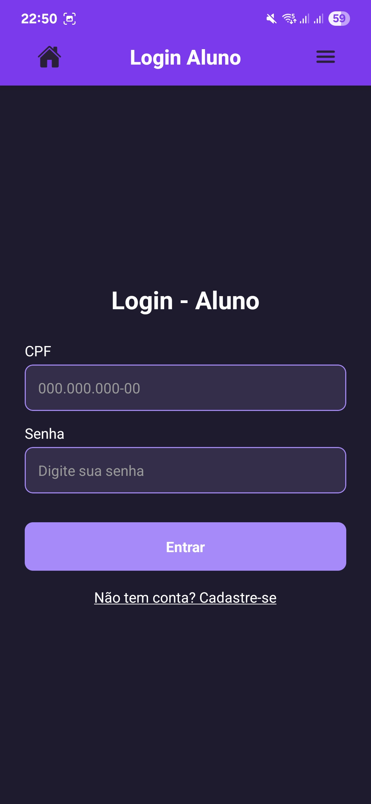
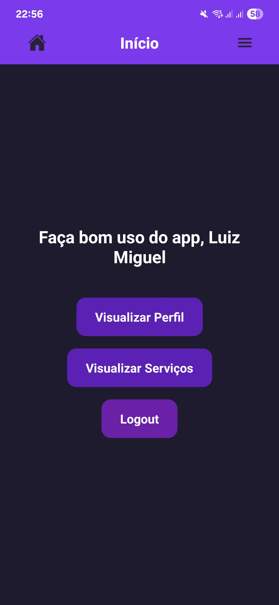
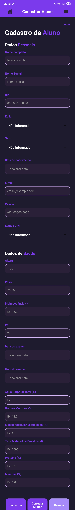
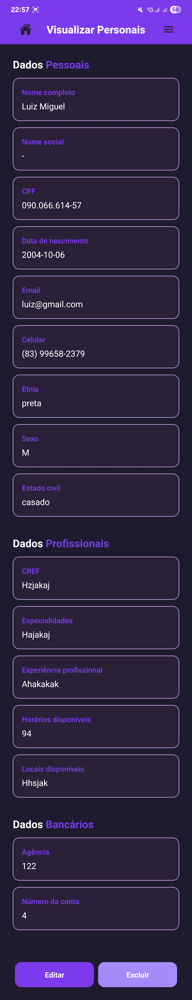
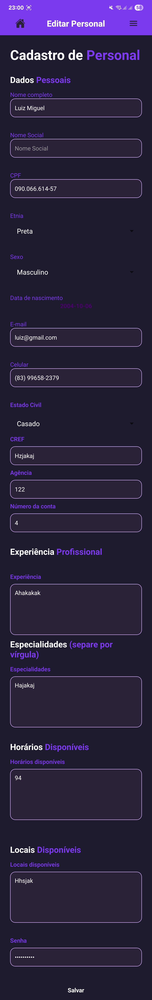
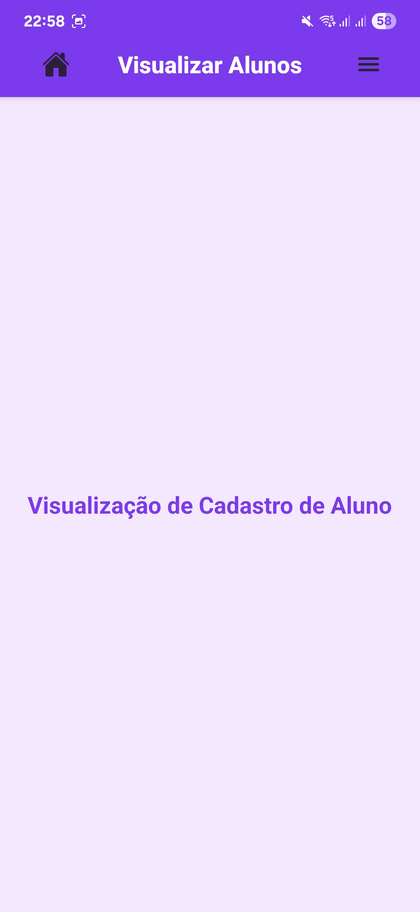
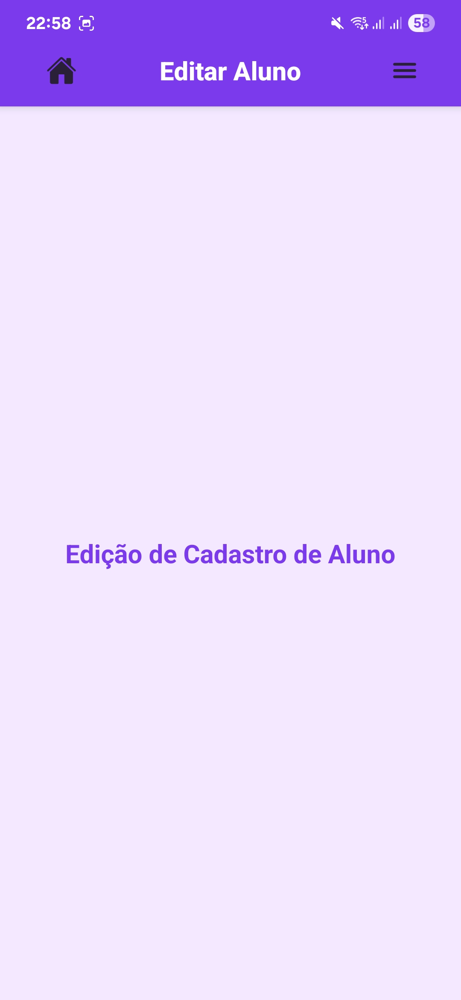
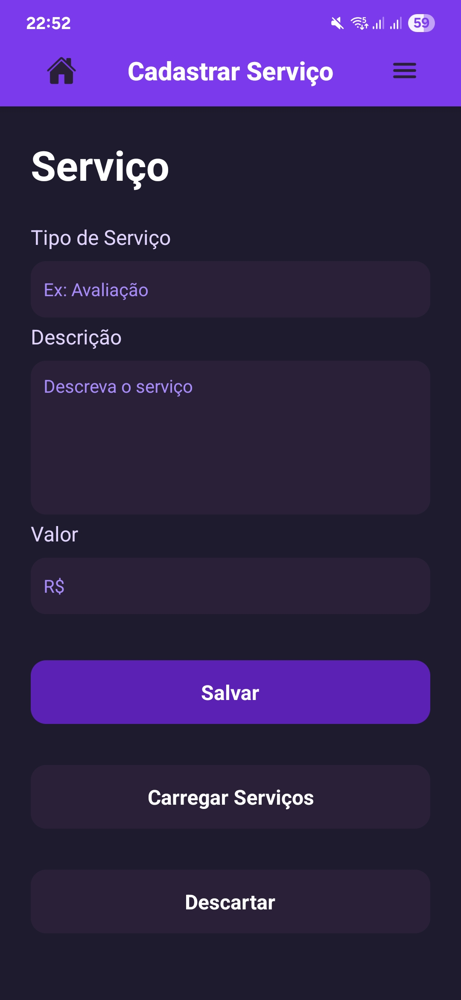
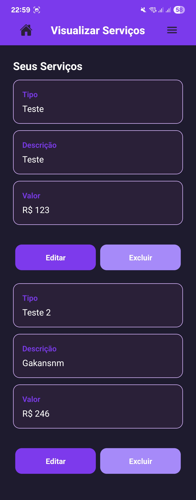

# 📄 Relatório Técnico - Aplicativo de Gestão para Personal Trainers e Alunos

## 📌 Equipe de Desenvolvimento
**The Full-Stacks**
- José Alves
- Luiz Miguel
- Renan Missias

---

## 🎯 Objetivo do Projeto
Desenvolver um aplicativo inovador que fortaleça a conexão entre personal trainers e alunos, promovendo hábitos saudáveis por meio de desafios, metas e gamificação. O sistema visa oferecer uma experiência prática, confiável e motivadora.

---

## 👥 Público-Alvo
- **Clientes:** Educadores físicos, personal trainers
- **Usuários Finais:** Alunos de academias e profissionais da área
- **Inspiração visual e funcional:** Duolingo, Strava
- **Imagem a ser transmitida:** Leveza, confiança, praticidade e sofisticação

---

## 🧱 Entidades Representativas e Atributos

### 🧑‍🏫 Personal Trainer

| Campo | Tipo | Observações |
|-------|------|-------------|
| nome | string | |
| nome_social | string | |
| cpf | string | Validação brasileira |
| etnia | string | |
| sexo | string | |
| data_de_nascimento | date | |
| email | string | |
| numero_de_celular | string | |
| estado_civil | string | |
| cref | string | Registro profissional |
| numero_conta | string | |
| agencia | string | |
| especialidades | array de strings | Lista dinâmica |
| experiencia_profissional | texto | |
| horarios_disponiveis | array | Agenda disponível |
| locais_disponiveis | array | Locais de atendimento |
| senha | string | Criptografada |

---

### 🧍 Aluno

| Campo | Tipo | Observações |
|-------|------|-------------|
| nome | string | |
| cpf | string | |
| data_de_nascimento | date | |
| email | string | |
| numero_de_celular | string | |
| sexo | string | |
| nome_social | string | |
| etnia | string | |
| estado_civil | string | |
| senha | string | |
| bioimpedancia | boolean | Indica se houve exame |
| data_do_exame | date | Opcional |
| hora_do_exame | time | Opcional |
| altura | float | em cm |
| agua_corporal_total | float | % |
| proteinas | float | % |
| minerais | float | % |
| gordura_corporal | float | % |
| peso | float | kg |
| massa_muscular_esqueletica | float | kg |
| imc | float | Calculado |
| taxa_metabolica_basal | float | kcal |

---

### 🛎️ Serviço

| Campo | Tipo | Observações |
|-------|------|-------------|
| tipo | string | ex: "avaliação", "treino personalizado" |
| descricao | string | texto livre |
| valor | float | R$ |

---

### 📄 Contrato *(Telas ainda serão implementadas)*

| Campo | Tipo | Observações |
|-------|------|-------------|
| aluno_id | ref Aluno | |
| personal_id | ref Personal | |
| servico_id | ref Serviço | |
| data_inicio | date | |
| data_fim | date | |
| valor_total | float | |
| status | string | ex: "ativo", "encerrado", "pendente" |

---

## 🧭 Mapeamento de Telas

### ✅ Telas Implementadas

### ✅ Telas Implementadas

- Login Personal

- Login Aluno

- Home (Dashboard)

- Cadastro de Personal Trainer

- Cadastro de Aluno

- Visualização de Personal

- Edição de Personal

- Visualização de Aluno

- Edição de Aluno

- Cadastro de Serviço

- Visualização de Serviço

- Edição de Serviço

---

### 🔜 Telas a Implementar

- Cadastro de Contrato
- Visualização de Contrato
- Edição de Contrato

---

### 🌟 Funcionalidade Futura: Gamificação do Progresso

- Sistema de pontos por consistência e metas atingidas
- Títulos e conquistas (ex: “Iniciante Dedicado”, “Mestre do Core”)
- Rankings locais e por especialidade
- Recompensas por fidelidade e progresso

---

## 🎨 Design e Usabilidade

| Aspecto | Diretriz |
|--------|----------|
| Estilo | Clean, sofisticado, leve |
| UX/UI | Navegação simples e fluida |
| Identidade visual | Cores claras, tipografia moderna, ícones intuitivos |
| Responsividade | Total adaptação para Android e iOS |
| Inspiração | Duolingo (gamificação) e Strava (social + fitness) |

---

## 🛠️ Tecnologias Utilizadas

- **Frontend:** React Native
- **Backend:** Django
- **Banco de Dados:** PostgreSQL
- **Integrações:** Instagram, Gmail, Outlook, Calendário, Chamadas telefônicas

---

## 📅 Cronograma de Entregas

| Marco | Entregas |
|-------|----------|
| **1º e 2º mês** | Refinamento da ideia, escopo, wireframes |
| **3º e 4º mês** | Backend, banco de dados, protótipo funcional |
| **5º e 6º mês** | Funcionalidades principais, testes internos |
| **7º e 8º mês** | Ajustes, lançamento beta, testes com usuários |

---

## 📊 Benchmarking

| App | Destaques |
|-----|-----------|
| **Duolingo** | Gamificação intuitiva e motivadora |
| **Strava** | Engajamento social e fidelização |

---

## ✅ Conclusão

O sistema em desenvolvimento possui uma base sólida de funcionalidades, com um foco diferenciado em engajamento, saúde e relacionamento entre profissionais e alunos. A estrutura modular permite escalar novas features como gamificação e gestão financeira. Com a implementação das telas restantes e a futura integração de jogos e recompensas, o app tende a se posicionar como referência no segmento fitness-tech.
